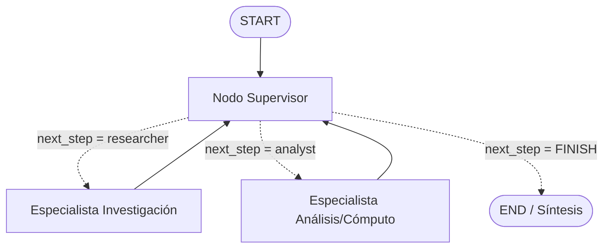

# AI Engineer Core: Unified Async LLM Client & Best Practices 🚀

Repositorio orientado al aprendizaje y puesta en práctica de patrones de diseño, arquitectura y buenas prácticas requeridas en el rol de **AI Engineer**.

Este proyecto implementa un cliente unificado, tipado, asíncrono y desacoplado para interactuar con los principales proveedores de modelos de lenguaje grande (LLMs): **OpenAI**, **Anthropic** y **Google GenAI**.


🛠️ Instalación y Entorno
1. Clonar el repositorio y crear entorno virtual
Se recomienda utilizar Python 3.12+:


```
bash
# Crear el entorno virtual
python -m venv .venv

# Activar entorno virtual
# En Windows (PowerShell):
.venv\Scripts\Activate.ps1
# En Linux/macOS:
source .venv/bin/activate
```

### 2. Instalar dependencias

> ⚠️ **Importante**: Si ejecutas los comandos en tu terminal local (PowerShell, CMD o Bash), **no utilices el prefijo `!`** (dicho prefijo solo se emplea dentro de Google Colab o Jupyter Notebooks).

Instalación directa:
```bash
pip install -q openai anthropic google-genai pydantic python-dotenv
```

O utilizando el archivo `requirements.txt`:
```bash
pip install -r requirements.txt
```

---

## 🔑 Configuración de Credenciales

El proyecto soporta dos mecanismos complementarios para gestionar las claves de API:

### Opción A: Archivo `.env` (Recomendado para desarrollo)
Copia el archivo `.env.example` y renómbralo a `.env`:

```env
OPENAI_API_KEY=tu_api_key_de_openai
ANTHROPIC_API_KEY=tu_api_key_de_anthropic
GOOGLE_API_KEY=tu_api_key_de_google_ai_studio
```

> **Nota:** Puedes obtener tu clave gratuita de Google en [Google AI Studio](https://aistudio.google.com/apikey).

### Opción B: Fallback Interactivo en Consola
Si ejecutas el script sin variables configuradas en el archivo `.env`, el sistema solicitará interactivamente las credenciales en tiempo de ejecución sin exponerlas en texto claro:

```python
import os
from getpass import getpass

if not os.environ.get("OPENAI_API_KEY"):
    os.environ["OPENAI_API_KEY"] = getpass("🔑 OPENAI_API_KEY: ").strip()

if not os.environ.get("ANTHROPIC_API_KEY"):
    os.environ["ANTHROPIC_API_KEY"] = getpass("🔑 ANTHROPIC_API_KEY: ").strip()

if not os.environ.get("GOOGLE_API_KEY"):
    os.environ["GOOGLE_API_KEY"] = getpass("🔑 Ingresá tu GOOGLE_API_KEY (gratis en aistudio.google.com/apikey): ").strip()
```

---

## 🚀 Ejecución y Validación

Para poner a prueba la intercambiabilidad de los clientes y el soporte de streaming, ejecuta el script principal:

```bash
python main.py
```

---

# Módulo 2: Pipeline de Extracción de Entidades Técnicas (LCEL & Resiliencia) 🛠️

Pipeline asíncrono para procesar texto desestructurado (logs o descripciones de arquitectura) y convertirlo en un objeto validado mediante Pydantic y LangChain.

### Dependencias adicionales
```bash
pip install -q langchain langchain-core langchain-openai langchain-anthropic langchain-google-genai
```

---

# Módulo 3: Sistema RAG Local con ChromaDB 📚

Flujo End-to-End de RAG para responder consultas sobre políticas internas utilizando ChromaDB local y LangChain (LCEL) con salida estructurada anti-alucinación.

### Dependencias adicionales

```bash
pip install -q chromadb langchain-chroma langchain-huggingface sentence-transformers langchain-community tiktoken
```

## Ejecución

```Bash
cd entrega3
python ingest.py
python main.py
```

---

# Módulo 4: Sistema RAG Escalable en la Nube con Pinecone y Búsqueda Híbrida 🌲

Pipeline de recuperación híbrida en la nube combinando búsqueda vectorial densa con Pinecone Serverless y búsqueda léxica dispersa con BM25 (`EnsembleRetriever`), evaluado mediante métricas objetivas de recuperación.

### Dependencias adicionales
```bash
pip install -q pinecone langchain-pinecone rank-bm25

```

### Configuración de Variables
Asegúrate de configurar en tu archivo `.env`:

```env
PINECONE_API_KEY=tu_api_key_de_pinecone
INDEX_NAME=techcorp-rag-hibrido
```

### Ejecución y Pruebas

```bash
# 1. Indexar los datos en Pinecone Serverless
cd entrega4
python ingest.py

# 2. Ejecutar la evaluación del benchmark
python evaluate.py

# 3. Probar el modo interactivo CLI
python main.py
```

---

# Módulo 5: Agente de Razonamiento Cíclico con Memoria Persistente (LangGraph + SQLite) 🤖🧠

Implementación de un agente autónomo bajo el patrón ReAct utilizando **LangGraph** y ejecución asíncrona (`asyncio`)[cite: 12, 13]. El sistema determina de forma autónoma la invocación de herramientas para resolver consultas multi-paso y preserva el estado conversacional entre ejecuciones mediante un checkpointer persistente en **SQLite**[cite: 12, 14].

### Dependencias adicionales
```bash
pip install -q langgraph langgraph-checkpoint-sqlite langchain-google-genai langchain-core aiosqlite
```

### Configuración de Variables
Asegúrate de configurar en tu archivo `.env`:
```env
GOOGLE_API_KEY=tu_api_key_de_gemini
```

### Componentes de la solución
* **`tools.py`**: Definición de herramientas con el decorador `@tool` y docstrings estructurados (`buscar_pedidos_cliente` y `consultar_detalle_pedido`), simulando un repositorio de datos de clientes y órdenes[cite: 12, 14, 15].
* **`agent.py`**: Construcción del grafo de estados con `StateGraph(MessagesState)`, aristas condicionales mediante `tools_condition` y persistencia de checkpoints con `AsyncSqliteSaver`[cite: 13, 14, 15].
* **`run_agent.py`**: Script de verificación con `recursion_limit` definido que ejecuta una consulta multi-paso, evalúa la memoria conversacional bajo un mismo `thread_id` y exporta la traza ReAct[cite: 12, 13, 14, 15].
* **`traza_ejecucion.json`**: Registro estructurado en JSON con la secuencia completa de pensamientos, invocaciones de herramientas y respuestas intermedias del agente[cite: 13, 14, 15].
* **`main.py`**: Interfaz de línea de comandos (CLI) interactiva con memoria contextual por sesión[cite: 12, 15].

### Ejecución y Pruebas

```bash
# 1. Ejecutar la prueba automatizada y generar la traza ReAct
cd entrega5
python run_agent.py

# 2. Probar el agente interactivo en terminal
python main.py
```

### Evidencia de Ejecución (Traza ReAct)
* **Razonamiento multi-paso:** El agente encadena automáticamente la búsqueda del listado de pedidos del cliente y la inspección del detalle de la última orden para responder al objetivo general[cite: 14, 21].
* **Persistencia de sesión:** Al formular una repregunta contextual (`"¿Y cómo abonó ese último pedido?"`), el agente recupera el estado previo del `thread_id` en SQLite sin requerir llamadas redundantes[cite: 12, 14, 21].


---

# Módulo 6: Orquestador Multi-Agente Especializado (Topología Jerárquica con LangGraph) 👥 orchestrator

Sistema multi-agente jerárquico basado en el patrón **Supervisor/Router**, diseñado para resolver consultas que involucran múltiples dominios técnicos (investigación técnica externa y cómputo/análisis cuantitativo) con síntesis ejecutiva final y control estricto de recursión.

### Topología y Justificación Arquitectónica
Se implementó una **topología jerárquica** centralizada en un nodo **Supervisor**:
* **Aislamiento de contexto:** Los especialistas (`researcher` y `analyst`) solo reciben los datos indispensables para ejecutar su tarea, evitando la contaminación de contexto entre dominios.
* **Resolución de conflictos y rúbrica de parada:** El Supervisor es la única entidad que decide el ruteo mediante retornos tipados (`Literal['researcher', 'analyst', 'FINISH']`), evaluando si la información es suficiente o si requiere refinamiento antes de emitir la síntesis final y pasar al nodo de finalización (`END`).
* **Prevención del "Supervisor Infinito":** Se incorpora un contador de pasos acumulativo (`step_count`) dentro del estado estructurado para forzar la finalización controlada si el flujo alcanza el umbral máximo de pasos.

### Diagrama del Grafo (Mermaid)



### Componentes de la solución
* **`state.py`**: Esquema `AgentState` (`TypedDict`) con mensajes acumulativos (`operator.add`), buffers específicos (`research_data`, `analysis_data`), decisión de ruteo (`next_step`) y contador de iteraciones (`step_count`).
* **`research_agent.py`**: Agente especialista equipado con la herramienta `consultar_benchmarks_cloud`, enfocado en recuperar métricas de rendimiento y costos base de infraestructura.
* **`analyst_agent.py`**: Agente especialista equipado con la herramienta `calcular_tco_anual`, enfocado en procesar estimaciones cuantitativas, impacto por latencia y proyección financiera según volumen.
* **`supervisor.py`**: Controlador de flujo con salida estructurada (`Pydantic` + `with_structured_output`) que audita las contribuciones de los especialistas y redacta la síntesis ejecutiva de cierre.
* **`graph.py`**: Ensamblado del `StateGraph` integrando los nodos, las aristas de retorno y las aristas condicionales de decisión.
* **`main.py`**: Script ejecutable de demostración del flujo multi-agente y exportación automática del diagrama Mermaid a `graph_diagram.md`.

### Dependencias
```bash
pip install -q langgraph langchain-google-genai langchain-core pydantic
```

### Configuración de Variables
Asegúrate de configurar en tu archivo `.env`:
```env
GOOGLE_API_KEY=tu_api_key_de_gemini
```

### Ejecución y Pruebas

```bash
# Ejecutar la demostración del orquestador multi-agente
cd entrega6
python main.py
```