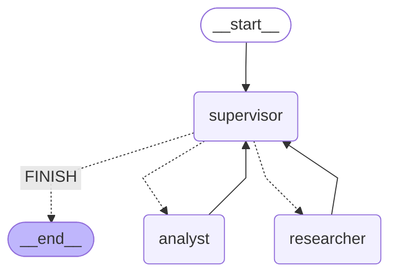

```mermaid
---
config:
  flowchart:
    curve: linear
---
graph TD;
	__start__([<p>__start__</p>]):::first
	supervisor(supervisor)
	researcher(researcher)
	analyst(analyst)
	__end__([<p>__end__</p>]):::last
	__start__ --> supervisor;
	analyst --> supervisor;
	researcher --> supervisor;
	supervisor -. &nbsp;FINISH&nbsp; .-> __end__;
	supervisor -.-> analyst;
	supervisor -.-> researcher;
	classDef default fill:#f2f0ff,line-height:1.2
	classDef first fill-opacity:0
	classDef last fill:#bfb6fc

```